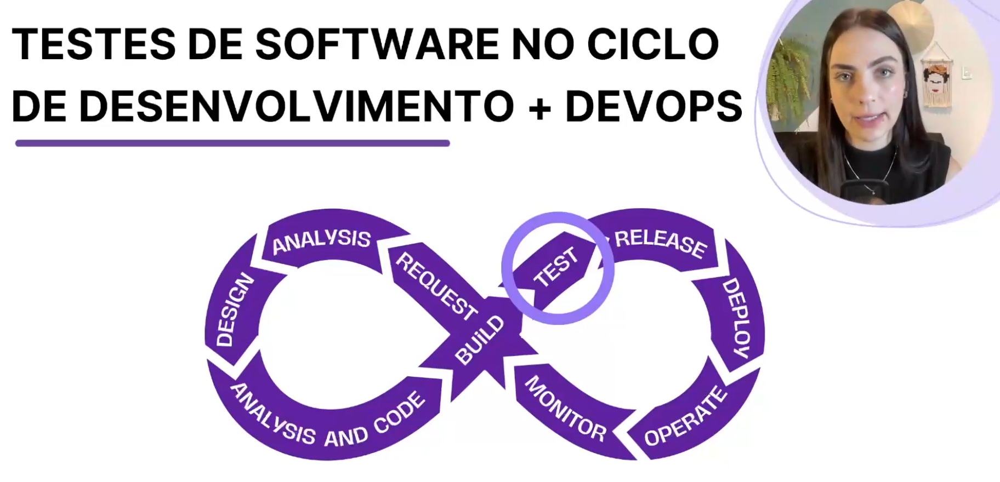
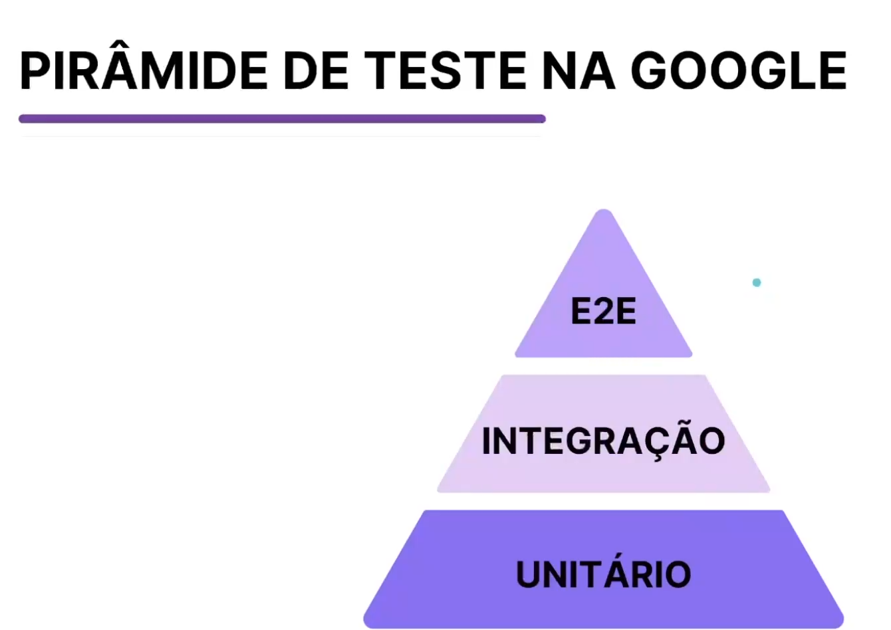

## Aula 01: Introdução aos testes de Software

### O qeu é testes de software? 

**ISTQB (International Software Testing Qualifications Board)**

* Processo que consiste em todas as atividades do ciclo de vida, estáticas e dinâmicas, relativas ao planejamento, à preparação e à avaliação de um sistema. 

* Determina que estes satisfazem os requisitos específicados, para demonstrar que são adequados para o propósito e para detectar defeitos.

### Importâancia do teste de software

* Embora o SDLC e DevOps considerem que o teste é uma etapa importante dentro do ciclo, o teste de software constribui em todas as fases para garantir que, ao final da construção do produto, ele atenda às necesssidades dos usuários. 

### Benefícios do teste de software

* Garantia de Qualdiade
* Identificação de Defeitos
* Redução de Custos
* Aumento da confiança

---

  

## Aula 02: Tipos de Teste de Software

### O que é tipos de teste?

Um tipo de teste é um grupo de atividades de teestes direcionada a testar características específicas de um software ou parte de um sistema, com base em objetivos de testes específicos. 

### Quais são os tipos de teste

**Define o que testar**

1. Funcional

    * Valida as funções que o sistema deve executar e O QUE ele deve fazer com base em seu comportamento

    * Valida as regras de negócio

    * Deve ser executado em todos os níveis de teste.

2. Não funcional

    * Avaliam as características de sistemas e de softwares, como usabilidade, eficiência de performance ou segurança.

    * Validamos o QUÃO BEM o sistema se comporta.

    * Se baseia na ISO 25010 com os aspéctos
        * Confiabilidade 
        * Usabilidade
        * Eficiência
        * Manutenibilidade
        * Portabilidade
        * Segurança
        * Compatibilidade
        * Proteção

3. Mudança (testes realacionados a mudança)

    * Quando são feitas alterações em um sistema, deve-se testar para confirmar se as alterações corrigiram o defeito ou implementaram a funcionalidade corretamente e não causaram consequências.

        * Teste de Confirmação
            * Chamado também de reteste, é executado após a coreção de um defeito.
            * valida o sucesso das ações corretivas

        * Teste de Regressão
            * O objetivo é garantir que as funcionalidades existentes continuem a funcionar corretamente após as modificações.
            * Valida que novos defeitos não sejam introduzidos no processo.

4. Caixa Branca

    * Baseado na estrutra interna ou na implementação do sistema. O objetivo é identificar se as funções internas do código funcionam corretamente. 

    * Incluí código, arquitetura e fluxos de dados. 

    * Conseguimos medir a cobertura de código.

---

  

## Aula 03: Níveis de Teste de Software

**Define quando testar**

Definem basicamente em qual fase de construçãodos software os testes serão executados, ou seja, qual o melhor momento de executá-los.

### Níveis de teste

1. Teste de Unidade

    * Normalmente realizado pelo próprio desenvolvedor.

    * Testa a menor unidade do sistema, geralmente um método.

    * Feedback mais rápido. 

2. Teste de Integração

    * Testa a integração das unidades que já foram testada individualmente.

    * Visa validar se as diferentes partes/componentes de um sistema funcionam corretamente juntas.

    * Exemplo: Suponha que temos uma API com um endpoint /saudacao que retorna uma mensagem de saudação para o usuário. Para testar se o endpoint está funcionando corretamente, podemos escrever um teste de ingegração que faz uma requisição GET.

3. Testes de sistema

    * Em geral aplicado pela aquipe de testes. 

    * Verifica as funcionalidades do sistema como um todo utilizando técnicas funcionais.

    * Ambiente controlado semelhante ao do cliente.

    * Gera insumo para permitir a liberação do produto ao cliente.

4. Teste de aceitação

    * Testes realizados pelos usuários da aplicação

    * Ocorre antes do sistema ser liberado em produção.

    * Verifica se a solução atende aos objetivos de negócio. 

    * Composto por duas categorias:
        * Alfa: Ambiente controlado para execução dos testes.
        * Beta: usuário livre para fazer as simulações de uso reais no sistema.

---

  

## Aula 04: Pirâmide de Testes

Modelo visual e conceitual proposto por Mike Cohn que sugere a distribuição ideal de diferentes tipos de testes de software para alcançar uma estratégia de teste eficaz e eficiente.

Atualmente este modelo sofreu algumas alterações e podemos nos basear no moodelo de piramide que a Google aplica internamente.

### Benefícios da pirâmide de teste

* Eficiência de custos e Tempo
* Feedback rápido
* Cobertura abrangentee Inteligente

---

  

## Aula 05: Manifesto to teste

Foi criado por Karen Greaves e Samantha Laing e foca na mentalidade necessária para uma abordagem de teste ágil bem-sucedida.

* Testar continuamente mais que testar no final

    * Não deixar os testes para só para o final depois que o desenvolvedor terminou de codar. 

    * Trazer os testes para todo o fluxo de desenvolvimento, para conseguirmos encontrar falhas o quanto antes. 

* Previnir deifeitos mais que encontrar defeitos

    * Começar a zelar pela qualidade do software desde as etapas iniciais para que os defeitos não avancem.

* Entender o teste mais que verificar a funcionalidade

    * Necessário validar se o teste faz sentido, se o usuário realmente usa o sistema da mesma forma que eu estou validando.

* Costruir o melhor sistema mais que quebrar o sistema

    * Além das técnicas para encontrar erros, vamos aplicar ténicas para encontrar melhorias para o sistema.

* Time responsável pela qualidade mais que responsabilidade do testador

    * A qualdiade é uma responsabilidade de todos que compõe o time.