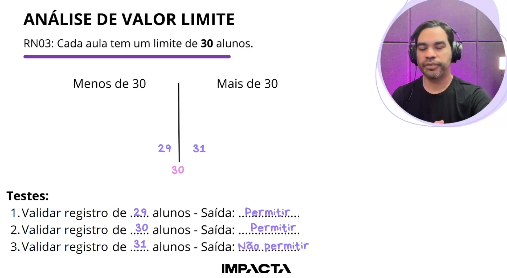

## Aula 01: Introdução às técnicas de testes e princípios de testes

### O que são técnicas de testes?

* São métodos ou abordagens que usamos para planejar e escrever testes;

* Classificados como caixa-preta, caixa-branca ou baseada na experiência.

* Técnica de Caixa Preta
   * Particionamento de equivalência
   * Tabela Decisão
   * Transição de estado

* Técnicas de Caixa branca
   * Cobertura de instrução
   * Teste de decisão
   * Cobertura de código 

* Técnica baseada em Experiência
   * teste exploratório
   * Baseado em checklist
   * Suposição do erro
 
Testes de *caixa preta* focam em verificar a funcionalidade de um componente *sem considerar sua implementação interna.
---

  

## Aula 02: Os sete princípios de testes

### Os sete princípios de teste

1. O teste mostra a presença de defeitos e não sua ausência
2. Testes exaustivos são impossíveis
3. O teste inicial economiza tempo e dinheiro
4. Defeitos se agrupam
5. Cuidado com o paradoxo do pesticida
6. O teste depende do contexto
7. A ausência de erro é uma ilusão

---

  

## Aula 03: Técnicas baseadas em experiências

## Testes baseados em lista de verificação (checklist)

O testador modela, implementa e executa testes para cobrir as condições de teste de uma lista de verificação.

---

## Teste baseado em suposição de erro

Usada para prever a ocorrência de erros, defeitos e falhas, com base no conhecimento do testador ou usuário

* Como o aplicativo funcionou no passado;
* Quais os tipos de erros que os desenvolvedores tendem a cometer
Os tipos de falhas que ocorreram em outros aplicativos semelhantes

  

## Aula 04: Particionamento de Equivalência

### Particionamento de Equivalência

* Também conhecida como classes de equivalência ou partições de equivalência;
* As partes devem ser formados por valores válidos e inválidos
* É baseada em regra de negócio

#### História de usuário

*Como* administrador do sistema de aula,
*Quero* garantir que os alunos se registrem corretamente,
*Para* que possam usufruir do sistema de ensino online.

#### Regras de Negócio
* RN01: Apenas alunos com idade entre 18 e 65 anos podem ser registrados.
* RN02: O registro de novos alunos é permitido apenas das 8h às 20h (horário local).
* RN03: Cada aula tem um limite de 30 alunos. Se a capacidade for atingida o aluno deve ser colocado em uma lista de espera.
* RN04: Alunos antigos matriculados a mais de 2 anos tem direito a um desconto de 15% nas mensalidades.

---

  

## Aula 05: Análise de Valor Limite

* É uma extensão do particionamento de equivaência;
* Só pode ser usada quando a partição é ordenada, consistindo em dado numéricos ou sequenciais;

---

### Valores flutuantes

* Usados para representar variáveis que não têm valores fixos e podem variar dentro de um intervalo contínuo. 

   * Horários
   * Preços
   * temperaturas
   * pesos
   * distancias
   * velocidade
   * volume
   * taxa de transferência de dados
   * largura da banda
   * latência
   * etc

---

  

## Aula 06: Tabela de decisão

* Também conhecida como Técnica de teste combinatória ou tabela de causa e efeito.

* Ajudam a mapear e testar todas as combinações possíveis de condições (causas) e ssesus respectivos resultados (efeitos);

* Útil para testar regras de negócio com diferentes condições de combinações que levam à resultados diferentes.

---

### História de usuário

*Como* administrador de um sistema de aula,
*Quero* garantir que os alunos se registrem corretamente,
*Para* que possam usufruir do sistema de ensino online. 

### Regra de negócio

* RN01: Apenas alunos com idade entre 18 e 65 anos podem ser registrados.
* RN02 O registro de novos alunos é permitido apenas das 8h às 20h (horário local).
* RN03: Cada aula tem um limite de 30 alunos. Se a capacidade for aringida, o aluno deve ser colocado em uma lista de espera.
* RN04: Alunos antigos matriculados há mais de 2 anos tem direito a um desconto de 15% nas mensalidades.

---

  

## Aula 07: Transição de Estado

* Técnica aplicada para testar a transição de um estado de um sistema, de um ponto A para um ponto B.

* Os testes são projetados para excutar transições de estado válido e inválidos;

* O objetivo é garantir que todas as transições entre os estados sejam corretamente implementadas e que o sistema funcione corretamente em todos os etados possíveis. 

